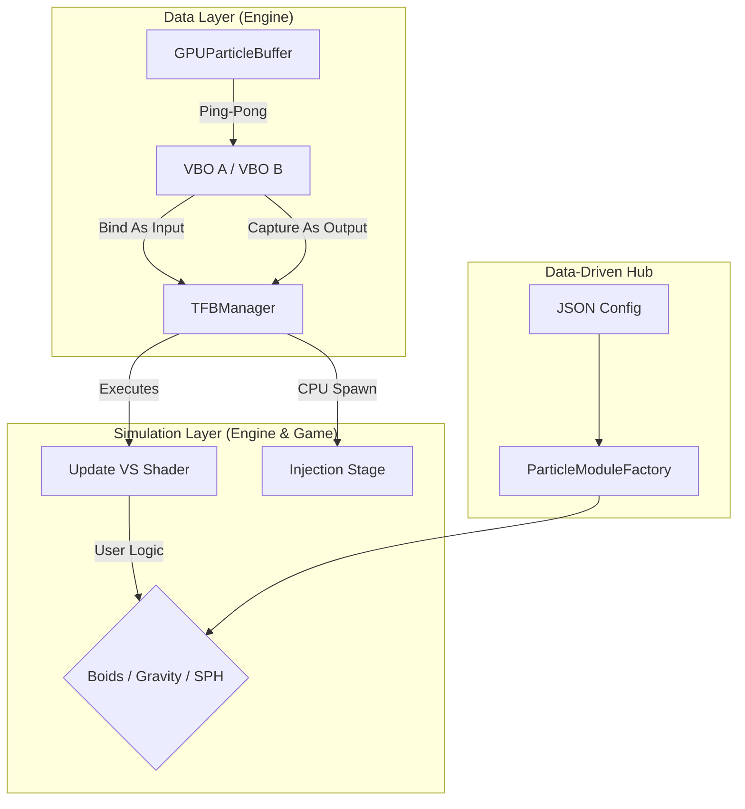
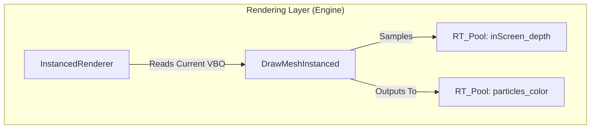

raylib的web2.0不支持computer shader,使用Transform Feedback代替，实现GPU粒子模拟




gemini的文件结构：
```text
src/
├── Engine/
│   ├── Graphics/
│   │   ├── ShaderWrapper.h/cpp      <-- 【升级】支持 TFB Varyings 捕获
│   │   ├── Renderer.h/cpp           <-- 【集成】调度粒子渲染到 RT 池
│   │   └── ParticleSystem/
│   │       ├── GPUParticleBuffer.h/cpp <-- 【核心】管理 VBO A/B 的内存与交换
│   │       ├── TFBManager.h/cpp         <-- 【核心】控制 glBeginTransformFeedback 等生命周期
│   │       ├── IParticleRenderer.h      <-- 【接口】定义渲染行为
│   │       ├── ParticleEmitter.h/cpp    <-- 【组件】挂载在 GameObject 上，负责 CPU 端发射逻辑
│   │       └── Renderers/
│   │           └── BillboardRenderer.h/cpp <-- 【实现】高性能实例化广告牌绘制
│   └── System/
│       └── ParticleModuleFactory.h/cpp  <-- 【工厂】根据 JSON 加载游戏层自定义 Shader 路径
│
├── Game/
│   ├── Particles/
│   │   ├── Shaders/
│   │   │   ├── sim_physics.vs           <-- 【用户定义】基础移动 GPU 物理
│   │   │   ├── sim_boids.vs             <-- 【用户定义】复杂鸟群 GPU 物理
│   │   │   └── render_standard.fs       <-- 【用户定义】粒子外观与软粒子逻辑
│   │   └── Modules/
│   │       └── BoidsModule.h/cpp        <-- 【用户定义】负责配置 Boids 所需的 Data Texture
│
└── assets/
    ├── config/
    │   └── particles/
    │       └── rocket_exhaust.json      <-- 【数据】定义发射器、Shader、物理参数
    └── shaders/
        └── particles/
            ├── default_tfb.vs           <-- 引擎内置的基础物理 VS
            └── soft_particle.fs         <-- 引擎内置的软粒子 FS
```

### 预计的代码工作流程 (单帧循环)

#### 1. CPU 决策阶段 (Spawning)
*   **计算发射量**：`ParticleEmitter` 根据 `emissionRate` 计算本帧需要产生的新粒子数量 $N$。
*   **分配空间**：在内存中找到 $N$ 个空闲索引。
*   **数据准备**：生成初始位置（如喷气口）、初速度（如放射状向量）。
*   **GPU 注入**：调用 `glBufferSubData`，将这 $N$ 个新粒子的数据写入 **当前输入 VBO** 的对应位置。

#### 2. GPU 模拟阶段 (Transform Feedback - TFB)
*   **绑定输入**：将 **Buffer A**（上一帧状态）绑定为 Shader 的 `in` 属性。
*   **绑定输出**：将 **Buffer B**（待更新状态）绑定到 `GL_TRANSFORM_FEEDBACK_BUFFER`。
*   **执行计算**：
    1.  开启 `GL_RASTERIZER_DISCARD`（只计算，不画像素）。
    2.  运行 `update.vs`：执行物理公式（$P = P + V \cdot dt$ 等）。
    3.  GPU 将 `out` 变量的结果直接写入 **Buffer B**。
*   **状态切换**：关闭反馈模式，执行 **Swap(Buffer A, Buffer B)**。

#### 3. GPU 渲染阶段 (Instanced Rendering)
*   **深度准备**：从 `m_rtPool` 获取 `inScreen_depth` 纹理。
*   **实例化绘制**：
    1.  使用 **Buffer A** 作为实例化属性（Instance Attributes）。
    2.  运行 `render.vs` / `render.fs`。
    3.  **软粒子处理**：在 FS 中对比 `gl_FragCoord.z` 与深度纹理，计算 Alpha 融合。
*   **输出**：结果绘制到 `m_rtPool["particles_color"]`。

---

# TODO List

#### Milestone 1: Shader 系统底层升级 (基础)
*   [ ✔] **修改 `ShaderWrapper`**：支持在 `Link` 阶段之前调用 `glTransformFeedbackVaryings`。
*   [ ✔] **扩展 `ResourceManager`**：增加 `GetShaderWithFeedback` 接口，支持传入需要捕获的变量名列表。

#### Milestone 2: GPU 乒乓缓冲管理器 (数据)
*   [ ✔] **创建 `GPUParticleBuffer` 类**：
    *   [ ✔] 可实例化，每个该类分配双 VBO对 (Buffer A/B)。
    *   [ ✔] 设置 VAO 映射，确保 Shader 能识别位置、速度等 layout。
    *   [ ✔] 实现 `Swap()` 函数。
    *   [ ✔] 实现 `UpdateSubData()` 用于 CPU 注入新生粒子。

#### Milestone 3: TFB 模拟驱动器 (模拟)
*   [ ✔] **实现 `TFBManager`**：
    *   [ ✔] 封装 `BeginFeedback()` 和 `EndFeedback()`。
    *   [ ✔] 编写第一个 GPU 物理 Shader：`simple_physics.vs`（处理位移和寿命衰减）。

#### Milestone 4: 粒子发射器与 CPU 注入 (逻辑)
*   [✔ ] **实现 `ParticleEmitter`**：
    *   [ ✔] 区分局部坐标与世界坐标（粒子可以只在局部坐标中产生，如固定在物体上的粒子等，也可以在世界坐标中产生，如轨迹等）。
    *   [ ✔] 管理粒子的索引池（哪些位置是死的，可以覆盖）。
    *   [ ✔] 实现“放射状”、“球体”、“圆锥”等初速度生成算法。
    *   [✔ ] 实现 `glBufferSubData` 的批量注入逻辑。

#### Milestone 5: 高性能实例化渲染器 (渲染)
*   [ ✔] **实现 `InstancedParticleRenderer`**：
    *   [ ✔] 编写支持实例化属性（Instance Attribute）的渲染 Shader。
    *   [✔ ] **软粒子逻辑**：在 FS 中实现基于 `inScreen_depth` 的深度裁切和渐变。
    *   [ ✔] 整合 `rlgl` 的 `DrawMeshInstanced` 或原生 `glDrawArraysInstanced`。

#### Milestone 6: 数据驱动与工厂模式 (集成)
*   [ ] **扩展 `ParticleModuleFactory`**：
    *   [ ] 将 GPU 物理 Shader 路径通过 JSON 注入。
*   [ ] **完善 `renderview.json`**：
    *   [ ] 定义粒子渲染在整个 Post-Process Graph 中的拓扑位置。
